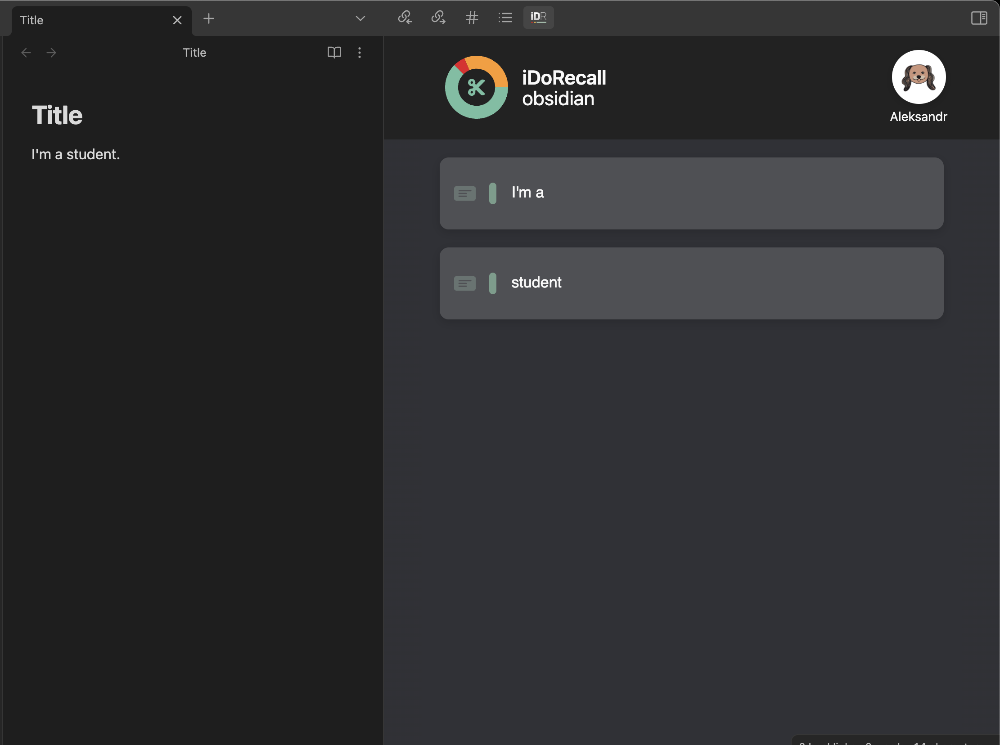

# IDoRecall in Obsidian

## Table of Contents

- [Introduction](#introduction)
- [Installation](#installation)
- [Usage](#usage)
- [Features](#features)
- [License](#license)

## Introduction

Welcome to the world of enhanced memory and knowledge retention through **IDoRecall**! This plugin is designed to seamlessly integrate with [Obsidian](https://obsidian.md/), a powerful note-taking application, to provide you with tools and techniques to enhance your memory recall and learning experience.

Whether you're a student, a researcher, a writer, or just someone eager to improve your memory, **IDoRecall** in Obsidian empowers you with methods like spaced repetition, active recall, and interactive learning to make your learning journey more effective and enjoyable.

## Installation

To get started with **IDoRecall** in Obsidian, follow these installation steps:

1. **Open Obsidian**: Make sure you have Obsidian installed on your system.

2. **Navigate to Community Plugins**: In Obsidian, go to `Settings > Community Plugins`.

3. **Install IDoRecall**: Search for "IDoRecall" in the plugin list and click the `Install` button next to it.

4. **Enable Plugin**: Once installed, enable the plugin by toggling the switch next to "**IDoRecall**".

## Usage

**IDoRecall** in Obsidian offers a range of features to enhance your learning and memory recall:

- **Flashcards**: Easily create flashcards within your notes and quiz yourself.

- **Spaced Repetition**: The plugin intelligently schedules your flashcards for review based on the proven spaced repetition technique, optimizing your recall over time.

- **Active Recall**: Prompt yourself with questions and prompts in your notes, forcing you to actively retrieve information, a technique known to boost retention.

- **Interlinking**: Leverage Obsidian's interlinking capabilities to create a web of knowledge that reinforces your memory.

## Features

- **Smart Scheduling**: **IDoRecall** uses advanced algorithms to schedule flashcard reviews at optimal intervals, ensuring efficient and long-lasting memory retention.

- **Markdown Support**: Since Obsidian uses Markdown for note-taking, **IDoRecall** seamlessly integrates with your existing notes, allowing you to create interactive learning experiences without leaving your familiar environment.

- **Progress Tracking**: Keep track of your learning progress with insightful statistics and visualizations that show how well you're retaining information.

## License

**IDoRecall** in Obsidian is distributed under the [MIT License](LICENSE), which means you're free to use, modify, and distribute the plugin as per the terms and conditions of the license.

---

Thank you for choosing **IDoRecall** in Obsidian to supercharge your learning experience. If you have any questions, feedback, or suggestions, don't hesitate to reach out. Happy learning and remembering! 🌟🧠📚
