## What is that ?

IDR plugin - This is a companion plugin for the [IDoRecall](https://www.idorecall.com/) web-app

Create flashcards that are linked to every fact, concept, term and formula that you want to remember. We call our linked spaced-repetition flashcards Recalls.

The plugin can work with plain text. In the future, there are plans to add the capability to work with images, videos, and audio materials, as well as PDF files.

## How to install
- You can install this plugin from the community section in Obsidian. 

- Or install plugin from the integration page within your IDoRecall application profile.

- Alternatively, you can download the latest release and put it into your vault's plugins folder at:

`your-vault/.obsidian/plugins`
## Requirements
  
In order to use the plugin, you need to create an account on [IDoRecall](https://app.idorecall.com/) or log in to your existing account. If you don't have an account on IDoRecall, you can create one. It's completely free.

To activate the plugin, primarily you need to generate an API key. To do this, follow these steps:
1. Log in to your IDoRecall account.
2. Go to your profile settings.
3. Navigate to the Integrations section.
4. Find the Obsidian widget and click on "Click to generate key."
5. Once generated, copy the API key.

  
Then, you need to activate the plugin in Obsidian. To do this, follow these steps:

1. Open your Obsidian application.
2. Go to the Settings.
3. Toggle the switch next to the IDoRecall plugin to enable it.
4. Click on the "Options" icon.
5. Paste the API key you copied earlier into the appropriate field.

This will activate the IDoRecall plugin within Obsidian and allow you to use its features.

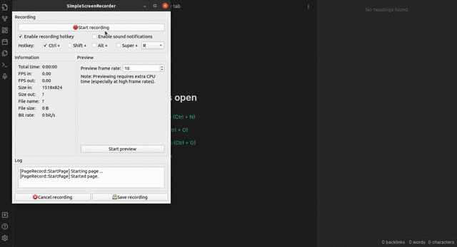

**Please note**: If you have multiple accounts within the IDoRecall application and you want to use them with the plugin, you need to generate a separate API key for each of these accounts.

The API key is used for synchronizing created flashcards (Recalls) between the plugin and the IDoRecall web application.

## Features

- Create flashcards. You can manually determine which field to send the content to. To do this, simply select the text and choose which field you'd like to send it to: Q (Question), A (Answer), or QA (Question and Answer).

- We support various text editing tools, including formatting options such as text size, styles, and more.

- You can create reversible recalls ** DAVID, PLEASE INSERT LINK ON THE VIDEO**
- Additionally, you can add tags to your flashcards (recalls) for more precise thematic classification of the material.

**Please note**: that practicing the recalls you've created (using the spaced repetition algorithm) is only possible in the web version of the IDoRecall application.

For more detailed information about how the "Practice" mode works, you can refer to the provided link. **DAVID, PLEASE INSERT THE LINK ON VIDEO**

## how does it work ?

To start using the plugin, simply highlight the text and determine which field you want to place it in: Question, Answer, or both (Question and Answer).

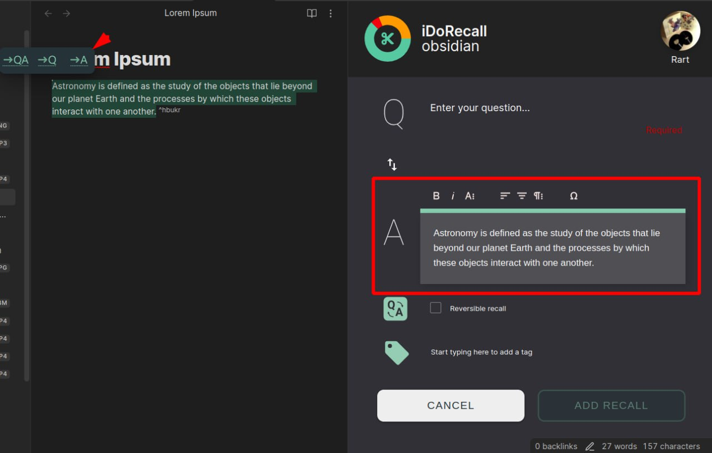

  
Then, fill in the empty field (in our example, Answer) and click the "ADD RECALL" button.

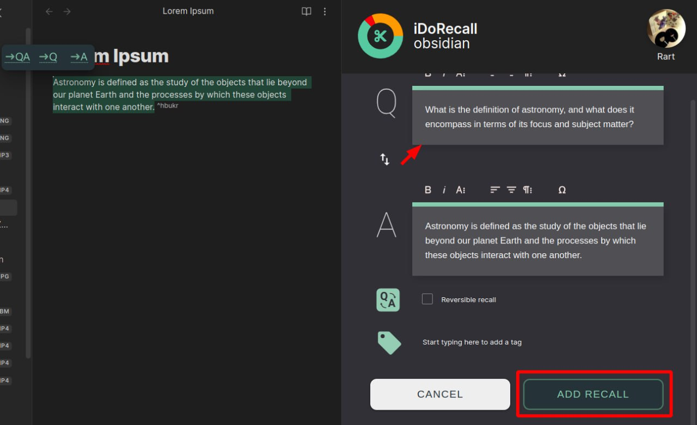

The recall you've created will be saved and accessible both within the plugin itself and in the IDoRecall application.

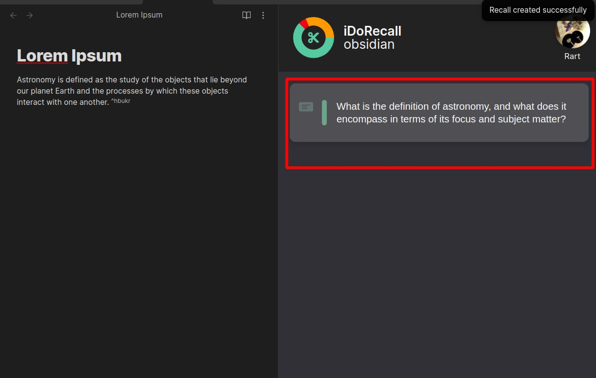

Now you have the opportunity to practice the recall you've created in the web application.

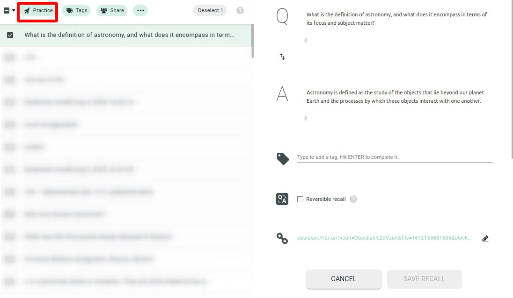

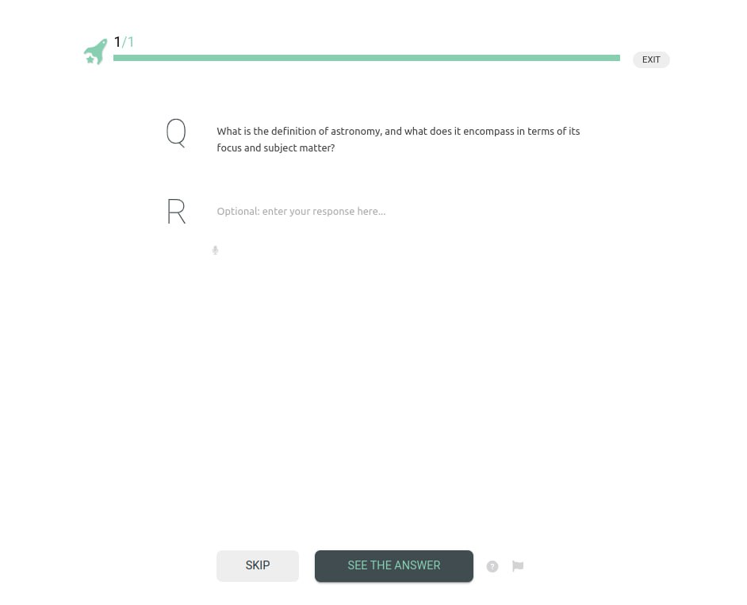

As we described earlier, API keys are used for synchronization between the web application and the plugin. To facilitate interaction, each recall created in Obsidian has a back link. Clicking on this link will allow you to return to Obsidian and view the section of text where the recall was created.

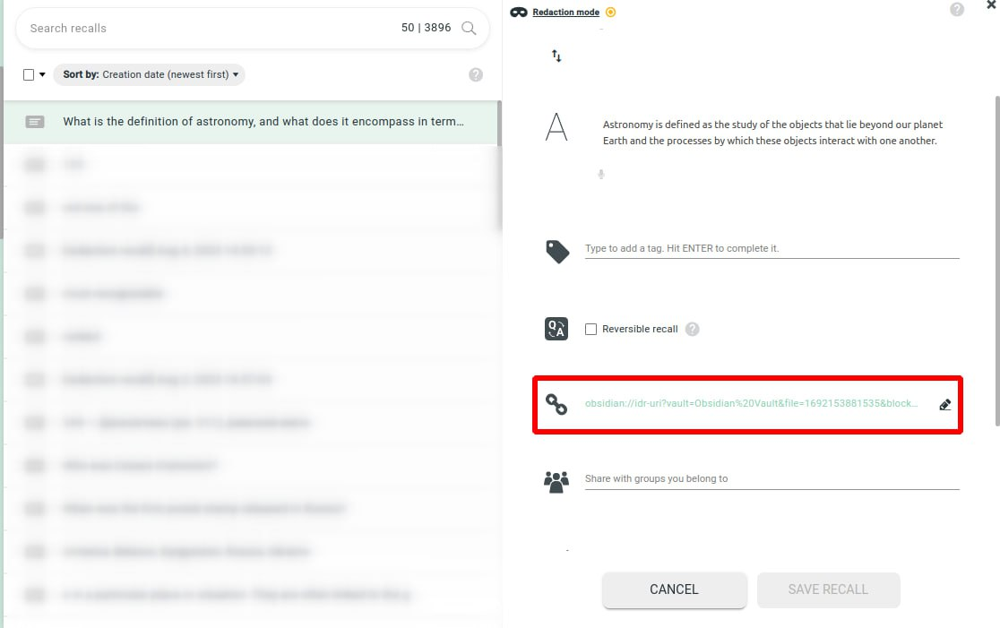

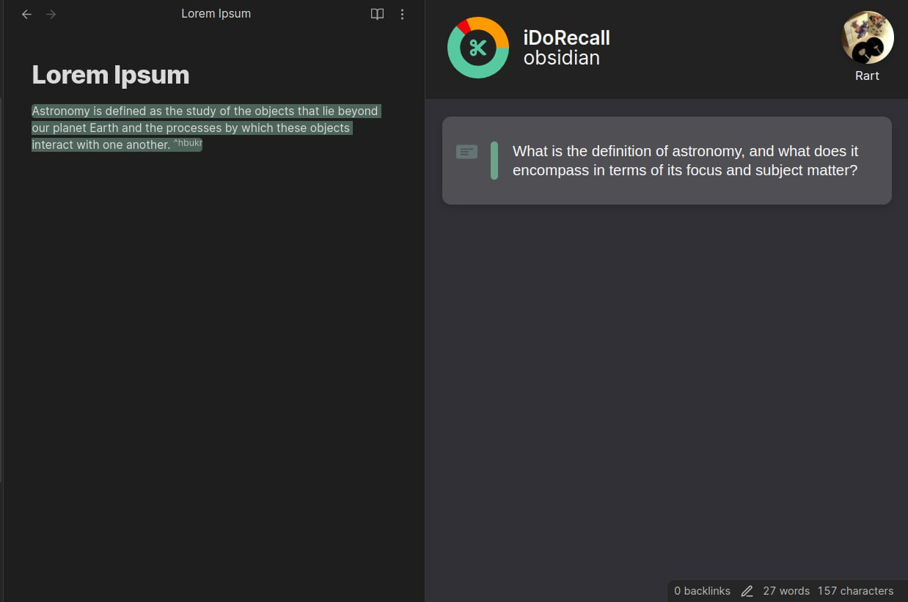

**Please note**: To enable the use of backlinks, we create a highlight ID next to each text block where a recall is created. Please do not delete this ID, as doing so will prevent you from being able to navigate to the created recall.

  
As mentioned earlier, you can use our tools to modify styles, sizes, and other parameters of the highlighted text.

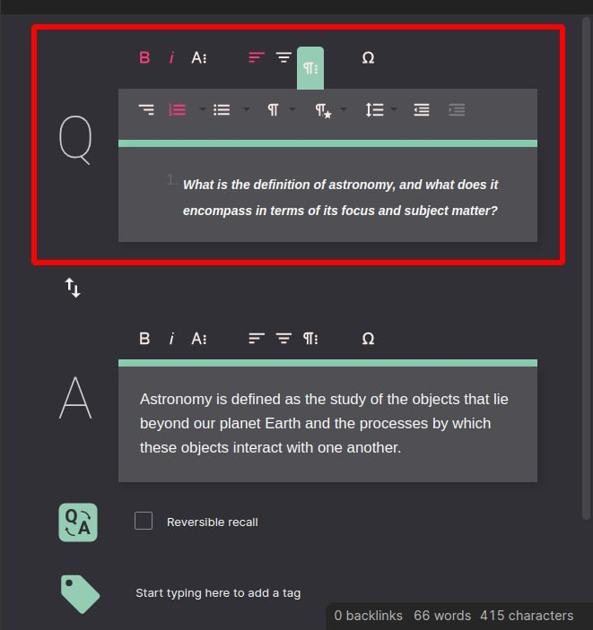

You can also add tags to a recall during its creation process. You can select an existing tag that was created in IDoRecall or create a new one. Tags assist in categorizing the recalls you create.

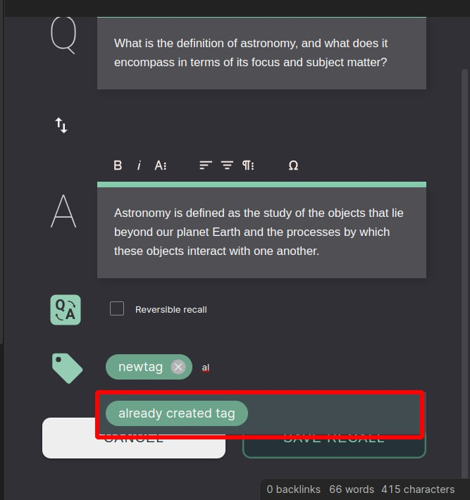

The IDR plugin also allows you to edit previously created recalls. To do this, click on the "Edit" button on the recall card. You can edit all fields, add or replace text, and the recall will retain its highlight and position on the note.

To save the changes, you need to click the "Add Recall" button again.

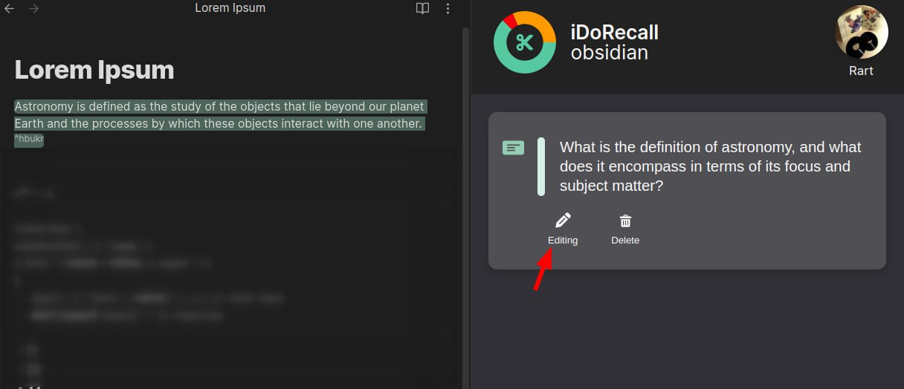

To delete a recall, you need to click the "Delete" button on the recall form. This will remove the recall from both Obsidian and the IDoRecall web application. However, the text that was highlighted will not be deleted from your Obsidian note.

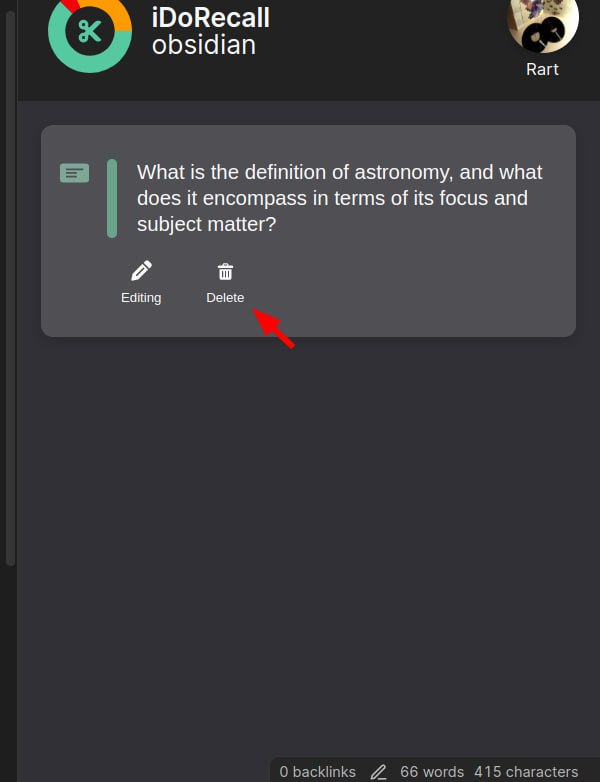

## Have ideas/Requests/Bugs ?

If you have ideas, suggestions, or encountered any issues, please don't hesitate to contact us using the following method: **DAVID, PLEASE INSERT LINK**
